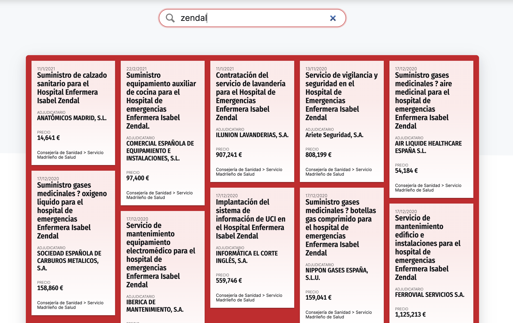
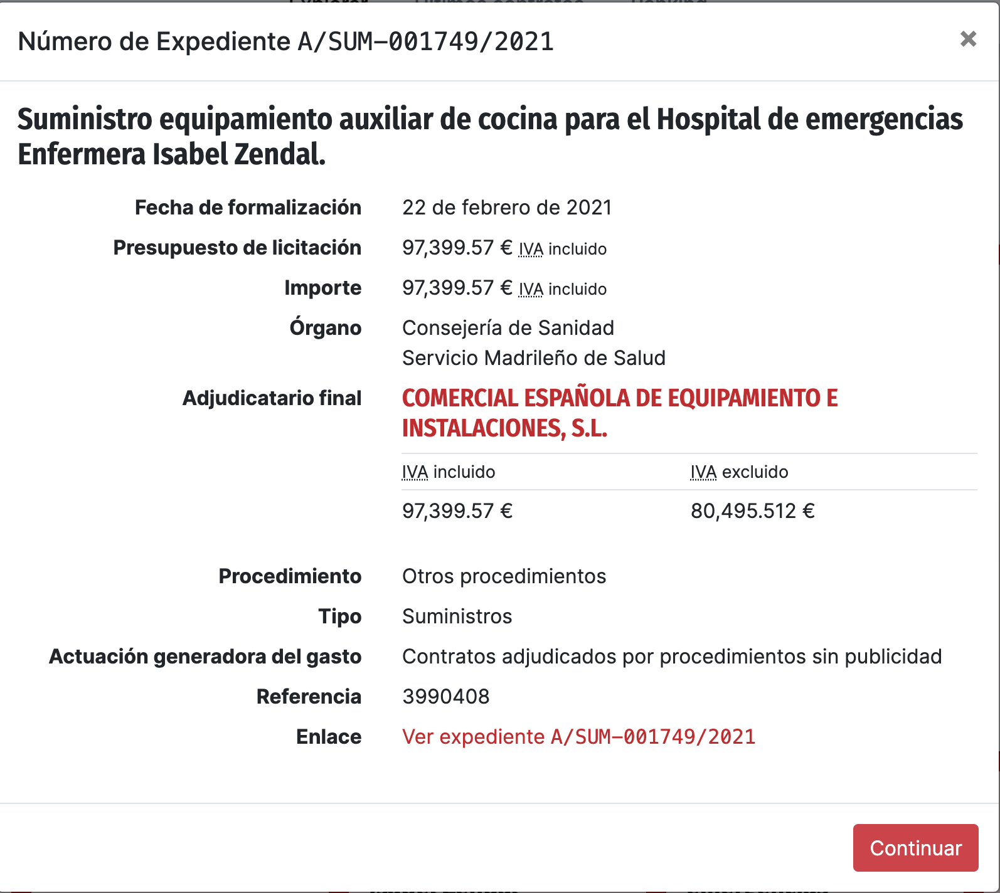
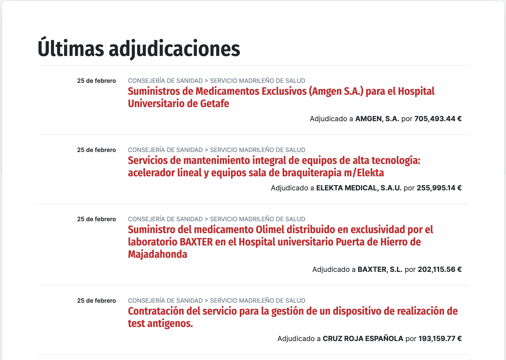
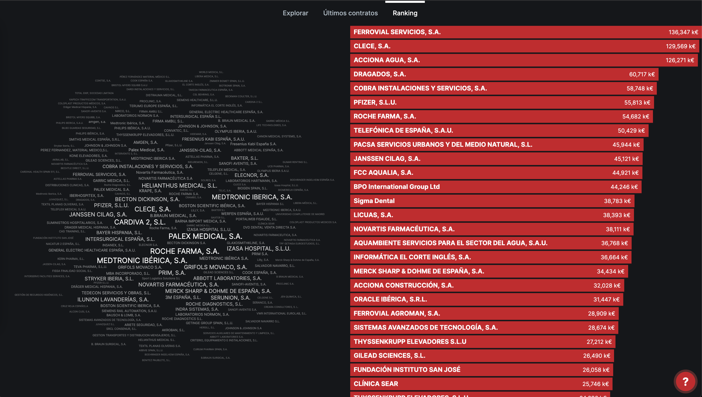
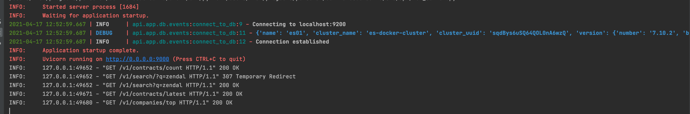
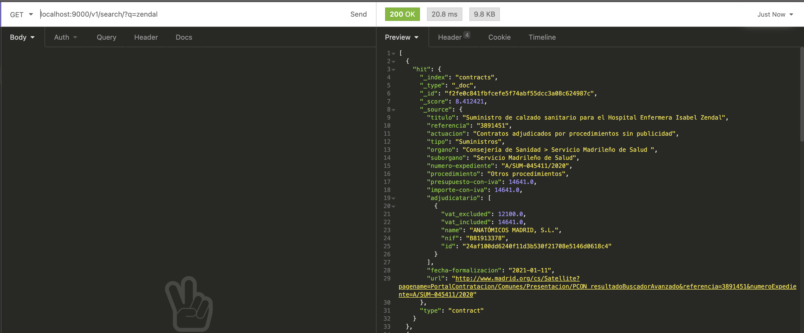
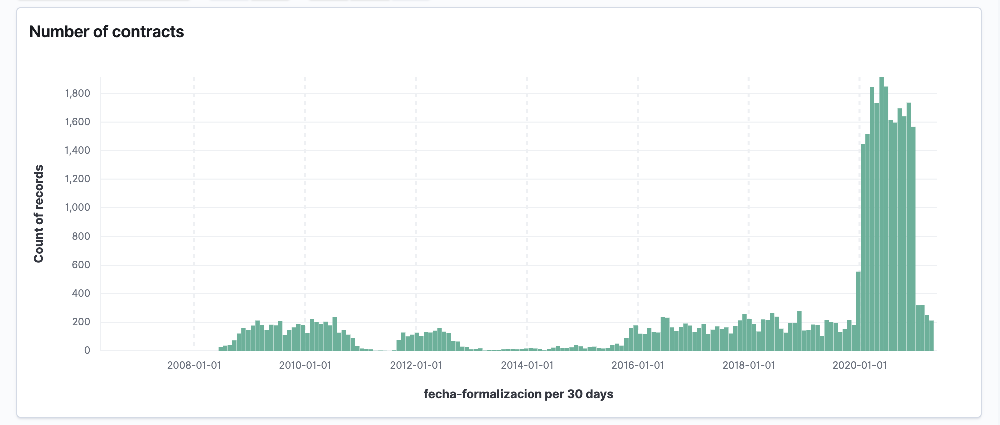

# ContratosDeMadrid API

## What is this?

This is an API reverse-engineered from [https://api.contratosdecantabria.es/](api.contratosdecantabria.es), 
with the following features:
- Open source
- Compatible with the frontend [contratosdecantabria.es](https://contratosdecantabria.es/)
- Adapted to work with public contracts published in the 
  [Portal de la contratación pública de la Comunidad de Madrid](http://www.madrid.org/cs/Satellite?cid=1224915242285&language=es&pagename=PortalContratacion/Page/PCON_buscadorAvanzado) 
  and the [BOCM](http://www.bocm.es/).
  
The API as well as the ETL code is developed in Python using [FastAPI](https://fastapi.tiangolo.com/), 
[BeautifulSoup](https://www.crummy.com/software/BeautifulSoup/bs4/doc/) and [Elasticsearch](https://elasticsearch-py.readthedocs.io/en/v7.12.0/).
  
## Why did you reverse-engineered an API?
The original API has been developed by [@JaimeObregon](https://github.com/JaimeObregon), but the code has not been open 
sourced (Neither the frontend nor the backend). I wanted to reuse the frontend, which is a great tool, so I kept the
same endpoints and object schema. Then, I downloaded the frontend source code from [https://contratosdecantabria.es/](https://contratosdecantabria.es/), modify the URLs to point to 
`localhost` and run the frontend with [ExpressJS](https://expressjs.com/):

- `packages.json`:
```json
{
  "name": "contratosdemadrid",
  "main": "index.js",
  "scripts": {
    "start": "node index.js",
    "test": "echo \"Error: no test specified\" && exit 1"
  },
  "dependencies": {
    "countup.js": "^2.0.7",
    "d3": "^5.16.0",
    "d3-array": "^2.7.1",
    "d3-cloud": "^1.2.5",
    "jquery-throttle-debounce": "^1.0.0"
  },
  "devDependencies": {
    "express": "^4.17.1"
  }
}
```

- `index.js`: 
```js
const express = require('express');
const app = express();
const PORT = 3000;

app.use(express.static('public'));
app.use('/node_modules/d3/dist/', express.static('node_modules/d3/dist/'));
app.use('/node_modules/d3-array/dist/', express.static('node_modules/d3-array/dist/'));
app.use('/node_modules/d3-cloud/build/', express.static('node_modules/d3-cloud/build/'));
app.use('/node_modules/countup.js/dist/', express.static('node_modules/countup.js/dist/'));
app.use('/node_modules/jquery-throttle-debounce/', express.static('node_modules/jquery-throttle-debounce/'));

app.get('/ultimo', function(req, res) {
    res.sendFile((__dirname + '/public/ultimo.html'));
});
app.get('/ranking', function(req, res) {
    res.sendFile((__dirname + '/public/ranking.html'));
});
app.get('/*', (req, res) => {
    res.sendFile(__dirname + '/public/index.html');
})


app.listen(PORT, () => console.log(`Server listening on port: ${PORT}`));
```

## Screenshots

DISCLAIMER: These screenshots are licensed under [Creative Commons Atribución 3.0 Spain](https://creativecommons.org/licenses/by/3.0/es/deed.en).
They have been obtained from a modified version of [contratosdecantabria.es](contratosdecantabria.es), courtesy of Jaime Gómez-Obregón.











## Getting started 

## 1. Install dependencies

- `pip install -r requirements.txt`

## 2. Start up database

- `docker-compose -d up`

### 3. Extract data

- `python3 src/etl/extract_csv.py --dir-path files/csv --start-date 2008-01-01`

### 4. Transform data

- `python3 src/etl/transform.py csv --input-dir-path files/json --output-dir-path files/json --start-date 2008-01-01`

### 5. Load (Requires step 1)

- `python3 src/etl/load.py companies --dir-path files/json --start-date 2008-01-01`
- `python3 src/etl/load.py contracts --dir-path files/json --start-date 2008-01-01`

### 6. Run API

- `cd src/api &&  python3 run_server.py`

## Contribute
Anyone that is interested on adapting the code to work with their local administration, feel free to fork the project.
If you want to obtain the data, contribute, or working on an open source project to 
improve the transparency in public procurement, please, create an issue to open a discussion.
